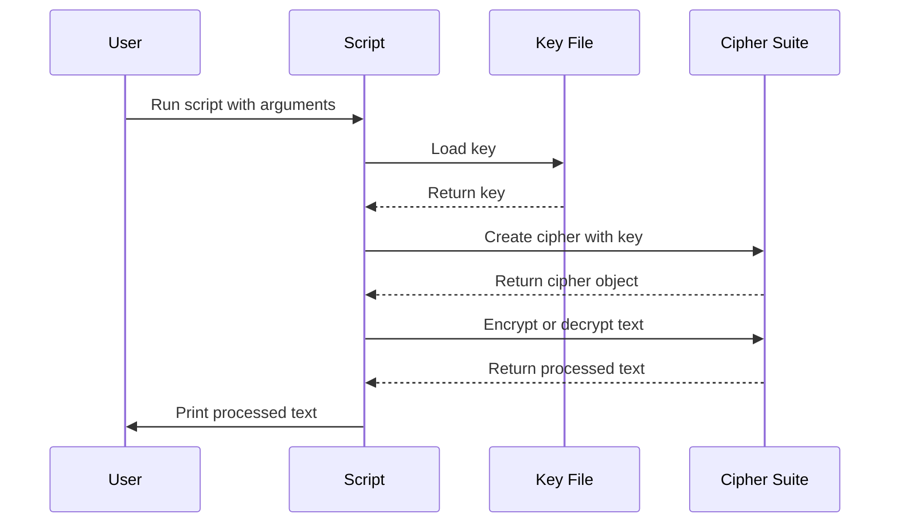

# Symmetric Encryption Script

This Python script allows you to encrypt and decrypt text using a symmetric key.

## Requirements

- Python 3
- cryptography library

You can install the cryptography library using pip:

```bash
pip install cryptography
```

## Usage

To run the script, you need to pass three arguments:

1. The path to the key file.
2. The text to encrypt or decrypt (must be enclosed in quotes if it contains spaces).
3. The mode, which should be either 'encode' to encrypt the text, or 'decode' to decrypt the text.

Here's an example of how to run the script:

`python3 symmetric.py symmetric.key "Hello World!" encode`

`In this example, symmetric.key is the key file, "Hello World!" is the text to encrypt, and encode is the mode.

If you want to decrypt text, you would use 'decode' as the mode:

`python3 symmetric.py symmetric.key "gAAAAABhE..." decode`

In this example, symmetric.key is the key file, "gAAAAABhE..." is the text to decrypt, and decode is the mode.

# Running in venv

```bash
python3 -m venv myenv
source myenv/bin/activatepip install cryptography
```

# Sequence diagram



# About the cipher

The cipher used in this script is a symmetric key cipher provided by the cryptography library's Fernet class.

A symmetric key cipher is a type of cipher where the same key is used for both encryption (converting plain text to cipher text) and decryption (converting cipher text back to plain text). This is in contrast to asymmetric key ciphers, where different keys are used for encryption and decryption.

The Fernet class in the cryptography library provides a secure implementation of symmetric key encryption. It uses the AES (Advanced Encryption Standard) cipher in CBC (Cipher Block Chaining) mode, with a 128-bit key for encryption. The encrypted message also includes a timestamp and is authenticated with a signature to ensure its integrity.

Here's a simple explanation of how it works:

Key generation: A random 128-bit key is generated. This key will be used for both encryption and decryption.

Encryption: The plain text message is divided into blocks, and each block is encrypted with the key using the AES cipher. The output is a series of encrypted blocks, or cipher text.

Decryption: The cipher text blocks are decrypted with the same key using the AES cipher, and the output is the original plain text message.

It's important to note that in symmetric key encryption, the security of the system relies on the key remaining secret. If the key is exposed, anyone can decrypt the cipher text and access the original message. Therefore, it's crucial to protect the key and ensure it's securely transmitted and stored.