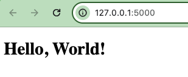
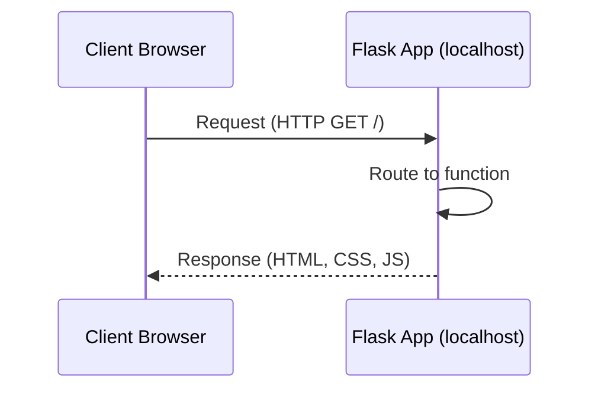

# Getting into Flask ASAP!

# What is Flask?

Flask is a lightweight python-based web server that is used to create web applications. 

# What do I need?

1. Python
2. Flask: `pip install flask`

# How do I start?

Create a simple application and put it in a file called `app.py` (code is [here](./flask/app.py)).:

```python
# Import the Flask module and create a Flask web server from the Flask module
from flask import Flask
# __name__ means this current file. In this case, it will be app.py. This current file will represent my web application.
app = Flask(__name__)

# We are using the route() decorator to tell Flask what URL should trigger our function.
# The function name is also used to generate URLs for that particular function, and returns the message we want to display in the user’s browser.
@app.route('/')
def hello_world():
    return 'Hello, World!'

# Main driver function. If we're running this file directly and not importing it, only then run the app.
if __name__ == '__main__':
    # run() method of Flask class runs the application on the local development server.
    # debug=True will provide a useful debugger to track the errors if any, in the application.
    app.run(debug=True)
```
## Run the application

```bash
python[3] app.py
```

...you should see...

```bash
* Serving Flask app 'app'
 * Debug mode: on
WARNING: This is a development server. Do not use it in a production deployment. Use a production WSGI server instead.
 * Running on http://127.0.0.1:5000
Press CTRL+C to quit
 * Restarting with stat
 * Debugger is active!
 * Debugger PIN: 490-867-972
127.0.0.1 - - [13/Feb/2024 08:40:13] "GET / HTTP/1.1" 200 -
```

# Running the application with a Flask HTML Template

Flask can leverage "templates" so you can make dynamic HTML. The [code is here](./flask/app2.py). The `templates` directory is required for this one. Here's how to run the same application with HTML:

`python[3] app2.py`

You will see the same output as before in your terminal, but now the HTML is being rendered in the web browser:



# Basic Architecture

Although in this example we are running the Flask app on our local machine, the architecture is the same as if it were running on a server. The client (browser) sends a request to the server (Flask app), and the server responds with HTML, CSS, and JavaScript. 




