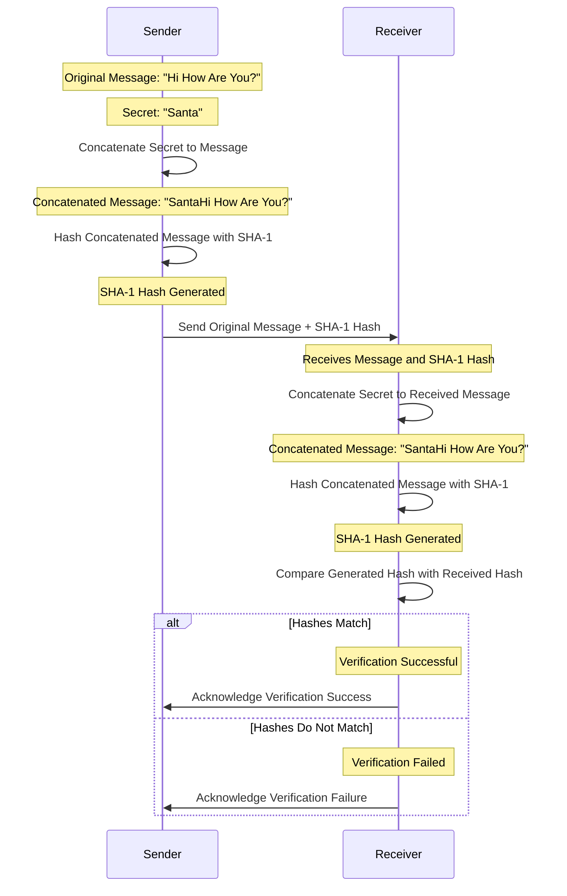

```mermaid
sequenceDiagram
    participant Sender
    participant Receiver

    Note over Sender: Original Message: "Hi How Are You?"
    Note over Sender: Secret: "Santa"
    Sender->>Sender: Concatenate Secret to Message
    Note over Sender: Concatenated Message: "SantaHi How Are You?"
    Sender->>Sender: Hash Concatenated Message with SHA-1
    Note over Sender: SHA-1 Hash Generated
    Sender->>Receiver: Send Original Message + SHA-1 Hash
    Note over Receiver: Receives Message and SHA-1 Hash
    Receiver->>Receiver: Concatenate Secret to Received Message
    Note over Receiver: Concatenated Message: "SantaHi How Are You?"
    Receiver->>Receiver: Hash Concatenated Message with SHA-1
    Note over Receiver: SHA-1 Hash Generated
    Receiver->>Receiver: Compare Generated Hash with Received Hash
    alt Hashes Match
        Note over Receiver: Verification Successful
        Receiver->>Sender: Acknowledge Verification Success
    else Hashes Do Not Match
        Note over Receiver: Verification Failed
        Receiver->>Sender: Acknowledge Verification Failure
    end

```